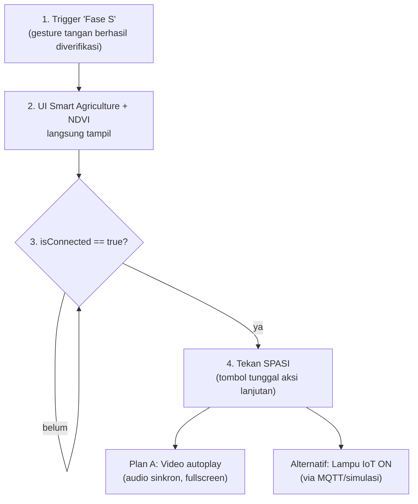

# MPD-SAG — AI Gesture Activation for Smart Agriculture IoT

Sistem deteksi gesture tangan **"S"** berbasis computer vision (MediaPipe + OpenCV) yang berfungsi sebagai *trigger* untuk sistem **Smart Agriculture IoT**. Begitu gesture "S" berhasil diverifikasi, sistem menampilkan panel **NDVI**, memeriksa status koneksi IoT, lalu menjalankan salah satu aksi lanjutan: memutar **video presentasi (Plan A)** atau mengaktifkan **lampu IoT (Alternatif)** — sesuai [`PRD_Smart_Agriculture_IoT.md`](./PRD_Smart_Agriculture_IoT.md).

> Dibuat untuk keperluan demo acara **OSPEK Prodi**.

Dokumentasi lengkap versi `.docx` juga tersedia di [`README.docx`](./README.docx).

---

## Daftar Isi

- [Ringkasan](#ringkasan)
- [Struktur File](#struktur-file)
- [Instalasi](#instalasi)
- [Cara Menjalankan](#cara-menjalankan)
- [Cara Membentuk Gesture "S"](#cara-membentuk-gesture-s)
- [Alur Sistem (Sesuai PRD)](#alur-sistem-sesuai-prd)
- [Kontrol Keyboard](#kontrol-keyboard)
- [Konfigurasi Penting](#konfigurasi-penting)
- [Dari Simulasi ke Hardware Nyata](#dari-simulasi-ke-hardware-nyata)
- [Catatan & Keterbatasan](#catatan--keterbatasan)
- [Checklist Sebelum Demo](#checklist-sebelum-demo)

---

## Ringkasan

| Modul | Fungsi |
|---|---|
| **Deteksi Gesture** | MediaPipe Hands melacak 21 landmark per tangan, mengklasifikasikan bentuk "C" (kiri) dan "C terbalik" (kanan), lalu memvalidasi posisi relatif membentuk huruf "S". |
| **State Machine** | `IDLE → VERIFY (2 detik) → ACTIVATE (progress 0–100% selama 5 detik) → DONE`, dengan progress bar dan 4 indikator LED (GREEN/BLUE/YELLOW/RED). |
| **NDVI Panel** | Simulasi nilai vegetasi (0.2–0.9, random-walk) + label status kesehatan tanaman, tampil begitu "Fase S" terdeteksi. |
| **Status Koneksi** | `ConnectionManager` — mode `SIMULATED` (default, aman tanpa hardware) atau `MQTT` (broker/ESP32 nyata). |
| **Plan A (Video)** | Autoplay video promo dengan audio sinkron (`ffpyplayer`), mode `fullscreen` atau `background`, berhenti di frame terakhir (tidak loop). |
| **Alternatif (Lampu IoT)** | Kirim perintah ON/OFF ke node lampu/relay via MQTT (`paho-mqtt`) atau simulasi (bohlam visual di layar). |

---

## Struktur File

```
MPD-SAG/
├── gesture_s_detection.py       # Script utama
├── PRD_Smart_Agriculture_IoT.md # Dokumen requirement asli
├── README.md                    # Dokumen ini (tampil di GitHub)
├── README.docx                  # Dokumentasi lengkap versi Word
├── .gitignore
└── assets/
    └── promo.mp4                # Video Plan A (taruh manual, tidak ikut di-push)
```

---

## Instalasi

Butuh Python 3.11 dan webcam aktif. Disarankan pakai virtual environment terpisah:

```bash
python -m venv venv
# Windows
venv\Scripts\activate

pip install mediapipe==0.10.21 opencv-python numpy paho-mqtt ffpyplayer
```

> **Kenapa `mediapipe==0.10.21`?** Google menghapus *Solutions API* (`mp.solutions.hands`, `mp.solutions.drawing_utils`) mulai MediaPipe v0.10.30 ke atas. Versi `0.10.21` adalah versi terakhir yang masih mendukungnya secara penuh — lihat [issue terkait](https://github.com/google-ai-edge/mediapipe/issues/6192).

---

## Cara Menjalankan

```bash
python gesture_s_detection.py
```

Begitu dijalankan, script akan menanyakan mode aksi lanjutan untuk sesi ini **sebelum** kamera menyala:

```
Pilih aksi lanjutan untuk sesi demo ini (satu tombol SPASI akan menjalankan ini):
  1. VIDEO  (Plan A - putar video promo)
  2. LAMPU  (Alternatif - kirim ON ke lampu IoT)
Pilihan [1/2] (Enter = default 'VIDEO'):
```

Pilih `1`, `2`, atau tekan Enter untuk default. Jendela webcam lalu terbuka otomatis.

> Index kamera default `0`. Untuk DroidCam/kamera eksternal, ubah angka di `cv2.VideoCapture(0)` pada fungsi `main()`.

---

## Cara Membentuk Gesture "S"

1. Tangan **kiri** membentuk huruf **"C"** (jari melengkung terbuka ke kanan).
2. Tangan **kanan** membentuk **"C" terbalik**, diposisikan **di atas** tangan kiri.
3. Tahan pose selama **2 detik** → masuk tahap `VERIFY`.
4. Terus tahan sampai total **5 detik** → progress naik ke 100% (`DONE`).
5. Jika gesture lepas sebelum 100%, progress otomatis reset ke 0.

---

## Alur Sistem (Sesuai PRD)

Urutan resmi menurut `PRD_Smart_Agriculture_IoT.md` — video/lampu ada di paling akhir, bukan di awal:



- **FR-01 (Detection)** — Trigger "Fase S" = gesture "S" terverifikasi (state `ACTIVATE`/`DONE`).
- **FR-02 (Dashboard & UI)** — Panel NDVI tampil begitu Fase S terdeteksi.
- **FR-03 (Connection State)** — Aksi lanjutan baru bisa dijalankan setelah `isConnected == true` **dan** progress mencapai 100%.
- **FR-04 (Video Module)** — Plan A: autoplay + audio, mode background/fullscreen, tidak loop otomatis.
- **FR-05 (IoT Hardware Control)** — Alternatif: instruksi ON/OFF ke lampu via MQTT.

> PRD aslinya menyebut Plan A dan Alternatif sebagai **dua skenario pilihan (OR)**, bukan berurutan. Implementasi ini mengikuti itu — satu tombol (SPASI) menjalankan **salah satu**, sesuai mode yang dipilih di awal sesi.

---

## Kontrol Keyboard

| Tombol | Fungsi |
|---|---|
| `q` | Keluar dari program |
| `r` | Reset seluruh sistem (gesture, NDVI, koneksi, video, lampu) ke kondisi awal |
| **SPASI** | Jalankan aksi lanjutan (Video atau Lampu, sesuai pilihan di awal) — aktif setelah progress 100% & `Connected` |
| `s` | Stop video Plan A yang sedang berjalan |
| `v` | Putar ulang video Plan A dari awal |

---

## Konfigurasi Penting

Semua ada di bagian atas `gesture_s_detection.py`:

```python
VERIFY_DURATION   = 2.0        # detik menahan gesture untuk verifikasi
ACTIVATE_DURATION = 5.0        # detik menahan gesture sampai progress 100%

CONNECTION_MODE = "SIMULATED"  # "SIMULATED" atau "MQTT"
SIMULATED_CONNECT_DELAY = 1.5  # jeda animasi "Connecting..." saat SIMULATED

MQTT_BROKER = "192.168.1.100"  # IP broker/ESP32 saat mode MQTT
MQTT_PORT   = 1883
MQTT_TOPIC_LAMP = "smartagri/lampu"

PLAN_A_VIDEO_PATH = "assets/promo.mp4"
PLAN_A_MODE = "fullscreen"     # "fullscreen" atau "background"
PLAN_A_LOOP = False            # True = video mengulang otomatis setelah selesai

ACTION_MODE = "VIDEO"          # default sebelum dipilih interaktif di awal run
ACTION_KEY  = " "              # tombol tunggal untuk aksi lanjutan (default: spasi)
```

---

## Dari Simulasi ke Hardware Nyata

1. **Sekarang (rehearsal):** `CONNECTION_MODE = "SIMULATED"` — bohlam di layar + log console cukup untuk gladi bersih tanpa hardware.
2. **Level tengah (opsional):** set `CONNECTION_MODE = "MQTT"` dengan `MQTT_BROKER = "test.mosquitto.org"` (broker publik gratis), lalu subscribe topic `smartagri/lampu` dari HP (app **IoT MQTT Panel** / **MyMQTT**) untuk lihat pesan ON/OFF real-time tanpa lampu fisik.
3. **Hari-H:** ganti `MQTT_BROKER` ke IP ESP32/broker lokal sungguhan. ESP32 tinggal subscribe topic yang sama — payload `"ON"` → relay HIGH, `"OFF"` → LOW. **Tidak ada perubahan kode Python lain yang diperlukan.**

---

## Catatan & Keterbatasan

- UI Smart Agriculture saat ini berupa overlay di jendela OpenCV (bukan dashboard web terpisah) — cukup untuk demo panggung, beda dari arsitektur dashboard web pada umumnya.
- File `assets/promo.mp4` **tidak ikut di-push ke repo ini** (lihat `.gitignore`) — taruh manual sebelum menjalankan Plan A.
- Video Plan A butuh `ffpyplayer` untuk audio sinkron (mengandung ffmpeg statis bawaan, tidak perlu instalasi ffmpeg terpisah).

---

## Checklist Sebelum Demo

- [ ] Install dependency (`mediapipe==0.10.21`, `opencv-python`, `numpy`, `paho-mqtt`, `ffpyplayer`)
- [ ] Buat virtual environment khusus (hindari konflik protobuf/tensorflow di environment global)
- [ ] Taruh video di `assets/promo.mp4` jika Plan A dipakai
- [ ] Tentukan `CONNECTION_MODE`: `SIMULATED` (aman, tanpa hardware) atau `MQTT` (kalau ESP32 sudah siap)
- [ ] Tes gesture "S" di lokasi & pencahayaan acara sebenarnya
- [ ] Tes tombol `q` / `r` / SPASI / `s` / `v`

---

*Berdasarkan [`PRD_Smart_Agriculture_IoT.md`](./PRD_Smart_Agriculture_IoT.md), digenerate dari referensi audio PTT-20260714-WA0022.opus.*
